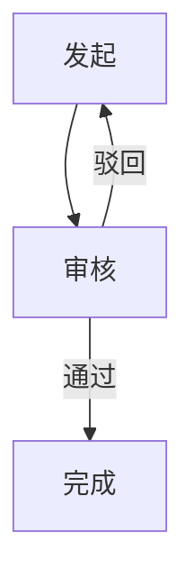

# 内部报销系统 产品需求文档 PRD

## 1 文档概述

### 1.1 文档目的

本文档定义产品的业务背景、用户角色、功能与非功能需求、接口概要、风险与验收标准，作为研发、测试与验收的依据。

### 1.2 范围

本文档覆盖产品从 v1.0 起的首期需求范围，包含核心业务流程与基础支撑能力。

### 1.3 修订记录

| 版本 | 日期 | 修订说明 | 作者 |
| --- | --- | --- | --- |
| v1.0 | 待填写 | 初稿 | PRD Agent |

## 2 业务背景与目标

业务背景：为提升内部效率而构建（mock 素材，供验证流程）

- **业务目标**：实现核心业务流程线上化，减少人工操作（mock）

## 3 用户角色说明

- **普通用户**：日常使用该产品的人
    - 作为普通用户，我希望快速完成核心操作，以便节省时间
- **管理员**：负责配置与审核
    - 作为管理员，我希望查看并审核所有记录，以便控制风险

## 4 业务流程图（mermaid）

## 5 功能需求

### 5.1 核心流程模块

#### 5.1.1 发起申请

- **编号**：FR-1
- **简述**：用户填写信息并发起申请
- **用户故事**：作为普通用户，我希望发起申请，以便完成业务
- **前置条件**：
- 用户已登录
- **输入**：
- 申请类型
- 金额
- 说明
- **输出**：生成一条待审核申请记录
- **操作流程**：
- 填写表单
- 提交
- 系统生成记录
- **异常流程**：
- 提交失败提示重试
- 金额超出限额拦截
- **验收标准**：
- 提交成功后状态为待审核
- 金额超限时系统拦截并给出提示

## 6 非功能需求

### 6.1 性能

- 常规操作响应时间 < 2 秒

### 6.2 安全

- 敏感数据加密存储，权限分级

### 6.3 兼容性

- 支持主流浏览器最新两个版本

### 6.4 合规

- 符合公司数据安全规范

### 6.5 可用性

- 核心流程 3 步内完成

## 7 外部依赖与接口概要

### 7.1 接口概要

- **用户认证接口**（入站）：登录鉴权，概要设计

### 7.2 外部依赖

- 企业微信集成（如涉及）

## 8 风险点与假设条件

### 8.1 风险点

- **边界场景考虑不全**（影响：高） 缓解措施：评审迭代补全异常流程

### 8.2 假设条件

> 以下为 AI 基于行业常识推断、用户未明确说明的信息（【假设】），请在评审时逐条确认：

- 产品名称/目标为 mock 假设，需人工确认
- 验收指标为 mock 假设，需业务确认

## 9 附录

- 本文档由 PRD 生成 Agent 自动生成，正文中标注【假设】的内容需人工确认后进入评审。
